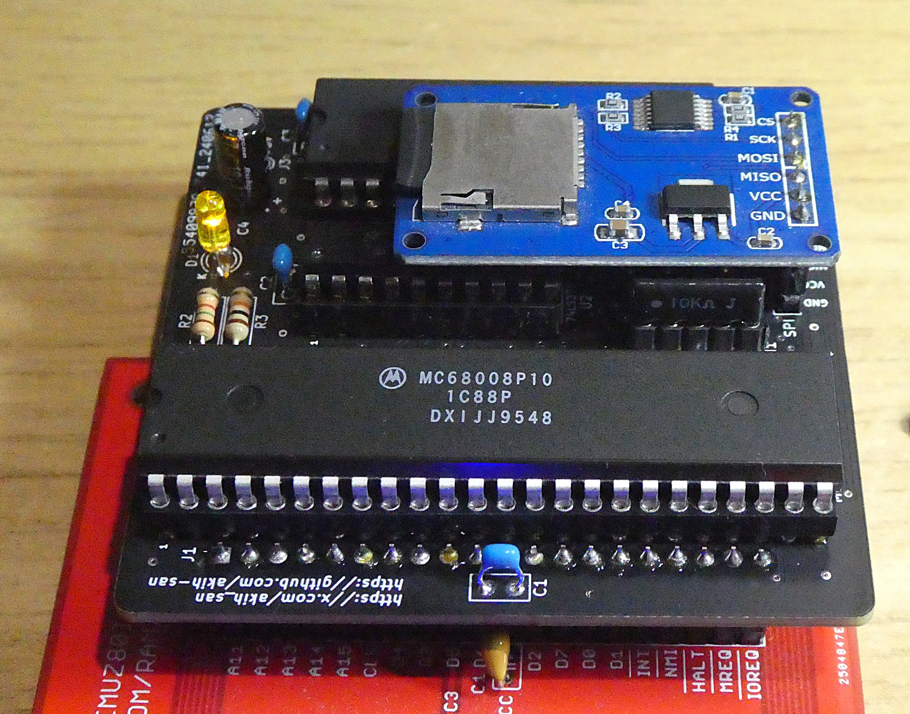
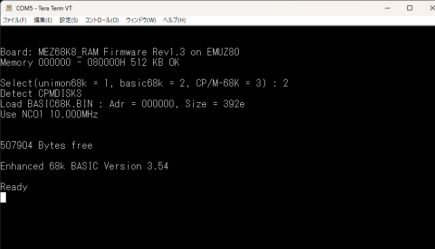
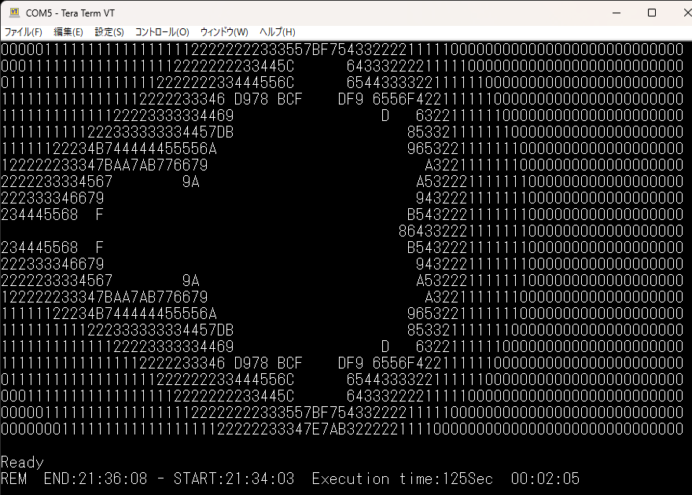
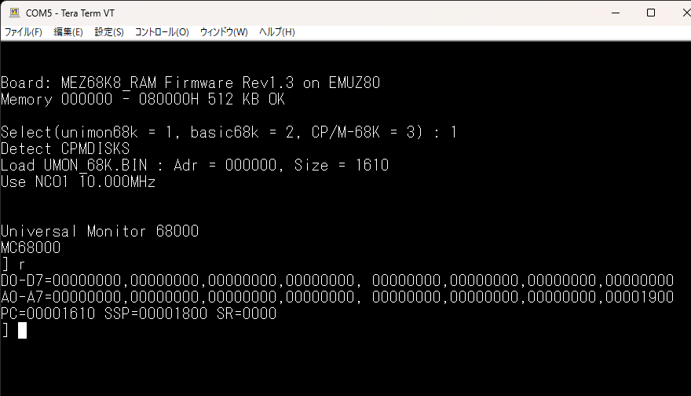
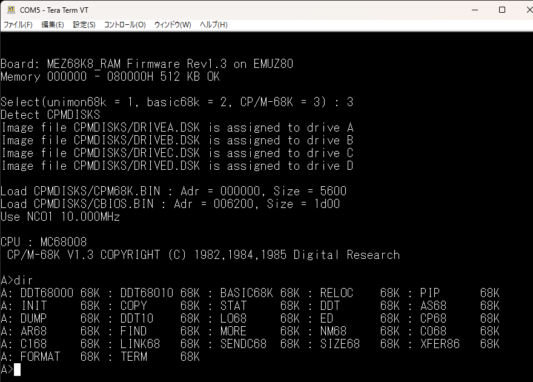
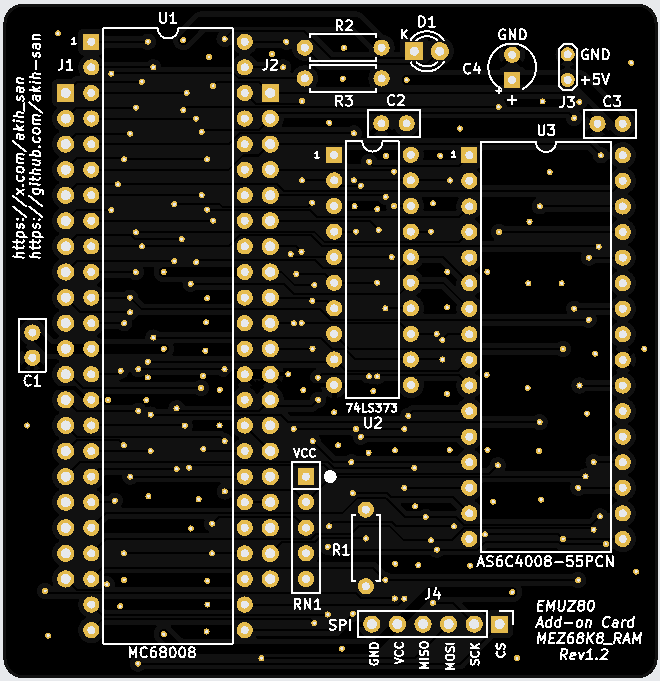
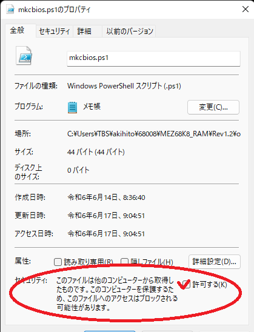

# MEZ68K8_RAM 
 
EMUZ80で、MC68008を動かすメザニンボードとして、＠S_OkueさんのMEZ68008 
が2022年にGithubで公開されています。 
https://github.com/satoshiokue/MEZ68008
 
 
MEZ68008は、PIC18F47QXX（PIC18F47Q43/Q84/Q83）によってコントロール 
されており、メモリリソースもPIC18F47QXX内蔵のメモリを使用しています。 
とてもシンプルな構造となっており、68Kに初めて触れる人には最適と言えます。 
 
EMUZ80は、電脳伝説さんが開発し公開されているSBCです。Z80の制御にPIC18F57Q43を 
使用し、最小限度の部品構成でZ80を動かしています。 
 
＜電脳伝説 - EMUZ80が完成＞   
https://vintagechips.wordpress.com/2022/03/05/emuz80_reference   
 
このことがきっかけで、その後コアな愛好者によって、色々な拡張や 
新しいSBCが公開されています。 
 
今回、68008用に、512KBのメモリとSDカードI/Fを追加したメザニンボード、 
MEZ68K8_RAMを作成しました。MEZ68008と同様に、EMUZ80にアドオンすることで 
動作します。 
メモリとSDカードを追加することにより、CP/M-68Kを動かすことが出来ました。 
 

MEZ68K8_RAMを搭載したEMUZ80 

 

MEZ68K8_RAM拡大 

# 特徴 
 
・MPU : MC68008P10 10MHz 
・Microcontroller : PIC18F47Q43, PIC18F47Q84, PIC18F47Q83 
・512K SRAM搭載(AS6C4008-55PCN) 
・μSDカードI/F（SPI) 
・UART（9600bps無手順） 
・動作ソフト（起動時に選択可能） 
　　1) Enhanced 68k BASIC Version 3.54 
　　2) Universal Monitor 68000 
　　3) CP/M-68K 
 

Enhanced 68k BASICの起動画面 

ASCIIARTの実行結果 

Universal Monitor 68000の起動画面 

CP/M-68Kの起動画面 

MEZ68K8_RAMシルク画像 

# ファームウェア（FW）
@hanyazouさんが作成したZ80で動作しているCP/M-80用のFWを 
(https://github.com/hanyazou/SuperMEZ80) 源流（ベース）にしています。 
今回は、MEZ88_RAM（https://github.com/akih-san/MEZ88_RAM） 用のFWを 
ベースにMEZ68K8_RAM用のFWとして動作するように修正を加えました。 
 
 
# CBIOSの開発環境
CP/M-68K Ver1.3は、[ここで](http://www.cpm.z80.de/binary.html)入手できます。 
また、[ここでも](http://www.easyaudiokit.com/bekkan2020/try_cpm68k/cpm68k.html)入手出来ます。 
CBIOS.BINは、DISK9にあるXBIOS.Cをベースに作成しました。 
Ｃコンパイラ、アセンブラは、Microtech Researchのクロス開発環境を使用しました。 
Internet Archiveウェブサイトから入手できます。 
https://archive.org/details/mri-68-k-c-cross-compiler-toolchain 
 
MSDOS上で動きますが、Windowsでは動作しないため、MSDOSが動く環境が必要になります。 
MEZ68K8_RAMでは、Windows上で動くエミュレーターとして有名なtakeda氏の 
msdos playerを使用しました。 
ここから（http://takeda-toshiya.my.coocan.jp/msdos/） 入手できます。 
こちらも、参考になるかと。 
http://iamdoingse.livedoor.blog/archives/24144518.html 
 
 
# CBIOS.BIN、CPM68K.BINを作成するために必要なツール 
 
・sed 
GNUの環境が必要になります。sedだけなら、ここから入手できます。 
https://sourceforge.net/projects/gnuwin32/files/sed/4.2.1/?sort=filename&sortdir=asc 
 
・bin2mot.exe、mot2bin.exe 
モトローラフォーマットのヘキサファイルとバイナリファイル相互変換ツール 
ソースとバイナリファイルは、ここから入手できます。 
https://sourceforge.net/projects/bin2mot/files/ 
 

# その他のツール
・FWのソースのコンパイルは、マイクロチップ社の 
 
　「MPLAB® X Integrated Development Environment (IDE)」 
 
　を使っています。（MPLAB X IDE v6.20）コンパイラは、XC8を使用しています。 
(https://www.microchip.com/en-us/tools-resources/develop/mplab-x-ide) 
 
・universal moniter 68000、及びEnhanced 68k BASICは、Macro Assembler AS V1.42を 
　使用してバイナリを作成しています。 
　ここから(http://john.ccac.rwth-aachen.de:8000/as/) 入手できます。 
 
・FatFsはR0.15を使用しています。 
　＜FatFs - Generic FAT Filesystem Module＞ 
　http://elm-chan.org/fsw/ff/00index_e.html 
 
・SDカード上のCP/Mイメージファイルの作成は、CpmtoolsGUIを利用しています。 
　＜CpmtoolsGUI - neko Java Home Page＞ 
　http://star.gmobb.jp/koji/cgi/wiki.cgi?page=CpmtoolsGUI 
 

# 注意
WindowsのPowerShellを使用して68000のバイナリを作成しますが、その際にPowerShellの 
スクリプトファイル（拡張子.ps1）を使用しています。 
GitHubからソースファイルをダウンロードした際は、スクリプトファイルのマクロ実行禁止 
になっていますので、それを解除する必要があります。 
操作は、ファイルのプロパティを表示させて、セキュリティを許可します。 

スクリプトファイルの実行禁止解除 

# 参考
＜EMUZ80＞ 
EUMZ80はZ80CPUとPIC18F47Q43のDIP40ピンIC2つで構成されるシンプルなコンピュータです。 
（電脳伝説 - EMUZ80が完成）   
https://vintagechips.wordpress.com/2022/03/05/emuz80_reference   
 
＜SuperMEZ80＞ 
SuperMEZ80は、EMUZ80にSRAMを追加しZ80をノーウェイトで動かすことができます。 
 
＜SuperMEZ80＞ 
https://github.com/satoshiokue/SuperMEZ80 
 
＜＠hanyazouさんのソース＞ 
https://github.com/hanyazou/SuperMEZ80/tree/mez80ram-cpm 
 
＜@electrelicさんのユニバーサルモニタ＞ 
https://electrelic.com/electrelic/node/1317 

＜オレンジピコショップ＞   
オレンジピコさんでEMUZ80、その他メザニンボードの購入できます。 
 
https://store.shopping.yahoo.co.jp/orangepicoshop/pico-a-051.html 
https://store.shopping.yahoo.co.jp/orangepicoshop/pico-a-061.html 
https://store.shopping.yahoo.co.jp/orangepicoshop/pico-a-062.html 
https://store.shopping.yahoo.co.jp/orangepicoshop/pico-a-079.html 
https://store.shopping.yahoo.co.jp/orangepicoshop/pico-a-087.html 
